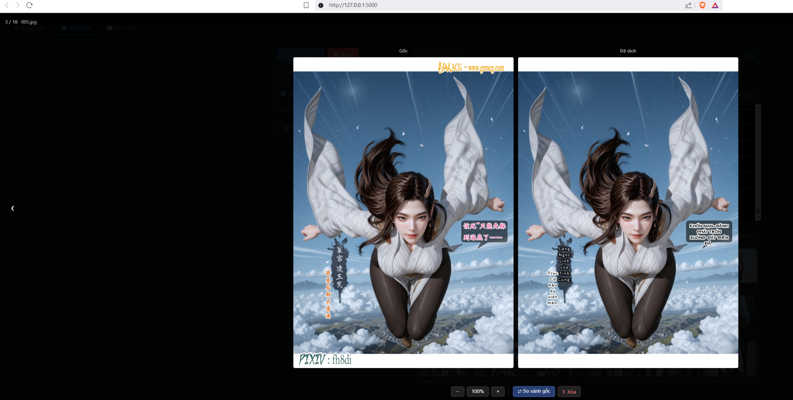

# 🕷️ Image Crawler & Manga Translator


> **Image Crawler** — Công cụ tải ảnh từ web + dịch manga (Trung/Anh → Việt) với OCR và model AI chạy local.

Một ứng dụng web Python kết hợp 4 chức năng chính:
1. 🕷️ **Crawl ảnh từ web** — Tự động phát hiện và tải ảnh từ bất kỳ trang web nào
2. ⬇️ **Download hàng loạt** — Multi-thread download (4 luồng), retry với backoff, thread-safe file naming
3. 🌐 **Dịch manga** — Dịch text Trung/Anh → Việt trong ảnh với OCR + Ollama hoặc `manga-image-translator`
4. 👁️ **Xem ảnh** — Lightbox viewer trực tiếp trên trình duyệt



---

## Yêu cầu hệ thống

- Python **3.10–3.12** cho web app (khuyên dùng 3.12)
- Python **3.11** riêng để chạy `manga-image-translator` (chỉ khi dùng MIT backend)
- Git (để clone MIT backend)
- Windows / Linux / macOS
- *(Tuỳ chọn)* GPU NVIDIA — tăng tốc OCR ~5×, bắt buộc cho LAMA inpainting

> 💡 Chỉ cần **crawl + xem ảnh** thì làm theo [Cài đặt nhanh](#cài-đặt-nhanh) là đủ.
> Muốn **dịch manga** thì cài thêm theo [Cài đặt tính năng dịch](#cài-đặt-tính-năng-dịch).

---

## Cài đặt nhanh

```powershell
# 1. Tạo virtual environment cho web app
python -m venv .venv
.venv\Scripts\activate          # Windows
# source .venv/bin/activate     # Linux/macOS

# 2. Cài dependencies cơ bản
pip install -r requirements.txt

# 3. Chạy server
python web_app.py
# hoặc double-click start.bat (Windows)
```

Trình duyệt sẽ tự mở tại `http://127.0.0.1:5000` (đổi port bằng biến môi trường `PORT`).

> Ngoài web app, có thể chạy `python app.py` để dùng **GUI desktop (Tkinter)** — chỉ có chức năng crawl ảnh, nhẹ và không cần trình duyệt.

---

## Cài đặt tính năng dịch

Có 2 backend dịch, cài 1 hoặc cả 2:

| Backend | Chất lượng | Cần cài |
|---|---|---|
| **OCR + Ollama** | Khá | Bước 1 + Bước 2 |
| **manga-image-translator (MIT)** | Tốt hơn (khuyên dùng) | Bước 2 + Bước 3 |

### Bước 1 — Cài OCR cho backend Ollama

```powershell
# Trong .venv của web app
python setup_translator.py
# Hoặc thủ công:
pip install torch torchvision --index-url https://download.pytorch.org/whl/cu124
pip install easyocr paddlepaddle paddleocr opencv-python
```

### Bước 2 — Cài Ollama

1. Tải và cài Ollama từ [ollama.com](https://ollama.com)
2. Kéo model về (chọn 1 theo VRAM của máy):

```powershell
ollama pull qwen2.5:7b          # ~4.7 GB, cân bằng tốt/nhanh
ollama pull qwen3:14b           # ~9 GB, chất lượng cao (cần 12+ GB VRAM)
ollama pull qwen2.5:32b-q4_K_M  # ~20 GB, chất lượng tốt nhất
```

3. Đảm bảo Ollama đang chạy (tray icon hoặc `ollama serve`)

> 💡 Model mà MIT backend dùng để dịch được chọn qua biến môi trường trong [start.bat](start.bat):
> ```bat
> set CUSTOM_OPENAI_API_BASE=http://localhost:11434/v1
> set CUSTOM_OPENAI_MODEL=qwen3-14b-nothink
> ```
> Sửa `CUSTOM_OPENAI_MODEL` thành tên model bạn đã pull trong Ollama.

### Bước 3 — Cài manga-image-translator (MIT backend)

> 📌 **Dùng bản fork [Phamvanvy/manga-image-translator](https://github.com/Phamvanvy/manga-image-translator)** thay vì repo gốc — bản fork đã được tối ưu riêng cho project này (dịch tiếng Việt). Các lệnh bên dưới đều clone từ fork.

#### Cách A — Tự động (Windows, khuyên dùng)

Double-click **`setup_mit.bat`** — script tự kiểm tra Python 3.11, tạo `mit_venv`, cài PyTorch + MIT và kiểm tra import. Sau khi xong, chạy thêm:

```powershell
python apply_patches.py
```

#### Cách B — Thủ công

> ⚠️ **KHÔNG dùng `pip install git+https://...`** — lệnh đó bỏ sót toàn bộ subpackages (`rendering/`, `translators/`...).
> Phải clone repo rồi cài editable (`-e`).

Chạy từng lệnh từ thư mục gốc project:

```powershell
# 1. Tải Python 3.11 từ https://python.org nếu chưa có
py -3.11 -m venv mit_venv

# 2. Nâng cấp pip
.\mit_venv\Scripts\python.exe -m pip install --upgrade pip

# 3. Cài PyTorch CUDA 12.4 (RTX 30/40/50 series)
.\mit_venv\Scripts\python.exe -m pip install torch torchvision --index-url https://download.pytorch.org/whl/cu124
# Không có GPU:
# .\mit_venv\Scripts\python.exe -m pip install torch torchvision

# 4. Clone bản fork đã tối ưu (PHẢI clone, không pip install git+)
git clone https://github.com/Phamvanvy/manga-image-translator.git tmp_repo

# 5. Cài dependencies từ repo
.\mit_venv\Scripts\python.exe -m pip install -r tmp_repo\requirements.txt

# 6. Cài package ở chế độ editable (bao gồm đầy đủ subpackages)
.\mit_venv\Scripts\python.exe -m pip install -e tmp_repo

# 7. Áp dụng các patch tùy chỉnh cho tiếng Việt
python apply_patches.py
```

**Kiểm tra sau khi cài:**
```powershell
.\mit_venv\Scripts\python.exe -c "import manga_translator; print('OK')"
# Kết quả mong đợi: OK
```

> **Lưu ý:**
> - `mit_venv` phải nằm trong cùng thư mục với `web_app.py`.
> - Mỗi lần cập nhật MIT hoặc tạo lại `mit_venv`, chạy lại `python apply_patches.py`.

---

## Sử dụng

### 1. Crawl ảnh
1. Mở tab **🕷️ Crawl ảnh**
2. Nhập URL trang chứa ảnh
3. Chọn thư mục lưu (nút 📁)
4. Chọn preset hoặc tùy chỉnh delay/workers/timeout
5. Bấm **▶ Bắt đầu**

### 2. Dịch manga (Trung/Anh → Việt)
1. Mở tab **🌐 Dịch ảnh**
2. Bấm **🔍 Kiểm tra** — đảm bảo các mục cần thiết hiện ✅
3. Chọn **Thư mục nguồn** (ảnh cần dịch)
4. Chọn **Backend**:
   - **OCR + Ollama**: cần EasyOCR/PaddleOCR + Ollama đang chạy
   - **manga-image-translator**: cần `mit_venv` đã cài (chất lượng tốt hơn)
5. Bấm **▶ Bắt đầu dịch**

### 3. Xem ảnh
1. Mở tab **👁️ Viewer**
2. Nhập đường dẫn thư mục
3. Click ảnh để mở lightbox

---

## Patches tùy chỉnh (`apply_patches.py`)

Thư mục `patches/` chứa các bản thay thế hoàn chỉnh cho **6 file** trong thư viện `manga-image-translator`, tối ưu cho việc dịch sang tiếng Việt. `apply_patches.py` tự tìm `manga_translator` (trong `mit_venv` hoặc bản editable) và copy patch vào đúng vị trí, đồng thời xoá bytecode cache cũ để patch có hiệu lực ngay.

> ⚠️ `tmp_repo/` là thư viện ngoài — **không sửa trực tiếp trong đó**.
> Mọi thay đổi phải được lưu vào `patches/` (source of truth) rồi chạy `python apply_patches.py`.

| File trong `patches/` | Đích trong `manga_translator/` | Nội dung thay đổi |
|---|---|---|
| `manga_translator_rendering_init.py` | `rendering/__init__.py` | • Giảm font size thay vì mở rộng bbox (tránh tràn bong bóng)<br>• `fg_bg_compare`: chữ đen + stroke trắng khi nền OCR tối<br>• Pixel sampling sau inpaint: nền <210 brightness → force chữ đen + stroke trắng<br>• Debug log `[stroke-debug]` per region |
| `manga_translator_rendering_text_render.py` | `rendering/text_render.py` | • Guard empty `line_width_list` (tránh crash với ký tự ZWJ)<br>• `bg_size = 0.4 × font_size` (min 4px) — stroke dày hơn mặc định 0.07<br>• `stroke_radius` dùng `border_size` thay vì hardcode 0.07 |
| `manga_translator_translators_custom_openai.py` | `translators/custom_openai.py` | • Translator OpenAI-compatible với segment markers `<\|n\|>` (chống mất chữ khi dịch dài)<br>• Watermark detection → ZWJ fallback<br>• Phát hiện chữ trang trí (brand print toàn Latin) → giữ nguyên artwork gốc<br>• Retry tới 10 lần nếu output không phải tiếng Việt |
| `manga_translator_detection_ctd.py` | `detection/ctd.py` | • CTD tôn trọng detection_size / text_threshold / box_threshold / unclip_ratio từ UI (mặc định cũ bị hardcode)<br>• Cải thiện phát hiện text nhỏ / SFX |
| `manga_translator_detection_init.py` | `detection/__init__.py` | • Vẽ tay vùng text qua env var `MIT_MANUAL_REGIONS` (JSON box chuẩn hoá 0–1) — thêm vùng OCR bỏ sót và inpaint chúng |
| `manga_translator_utils_generic.py` | `utils/generic.py` | • Guard crop rỗng khi bbox của textline nằm sát mép ảnh (tránh crash cv2.warpPerspective làm hỏng cả trang) |

**Workflow chỉnh sửa patch:**
```powershell
# 1. Sửa file trong patches/  (KHÔNG sửa trực tiếp trong tmp_repo/)
# 2. Áp dụng:
python apply_patches.py
# 3. Chạy lại web app để thấy kết quả
```

---

## Cấu trúc project

```
crawl/
├── web_app.py              — Flask server + tất cả API routes
├── app.py                  — GUI desktop (Tkinter), chỉ chức năng crawl
├── crawler.py              — Logic crawl và tải ảnh
├── translator_engine.py    — Shim tương thích (import từ package bên dưới)
├── translator_engine_pkg/  — Package dịch ảnh
│   ├── _ocr.py             — PaddleOCR/EasyOCR, bubble detection
│   ├── _utils.py           — Helpers: bbox, watermark, LAMA check
│   ├── _common_utils.py    — Helpers dùng chung
│   ├── _inpaint.py         — inpaint_region (OpenCV / LAMA)
│   ├── _translate.py       — Ollama API helpers, translate_batch
│   ├── _render.py          — Font loading, text rendering
│   ├── _image_translator.py — ImageTranslator class (Ollama backend)
│   └── _mit_backend.py     — MITImageTranslator class (MIT backend)
├── patches/                — Source of truth cho 6 patch MIT (sửa ở đây, không sửa tmp_repo/)
├── apply_patches.py        — Áp dụng patches vào manga_translator (tự tìm mit_venv / editable)
├── mit_inpaint_helper.py   — Inpaint với mask có sẵn bằng inpainter của MIT (chạy bằng mit_venv)
├── gpt_config_vi.yaml      — Config custom_openai translator
├── setup_translator.py     — Cài AI dependencies tự động (backend Ollama)
├── setup_mit.bat           — Cài MIT backend tự động (Windows)
├── requirements.txt        — Dependencies cơ bản (Flask, requests, ...)
├── start.bat               — Khởi động nhanh + set model Ollama cho MIT (Windows)
├── templates/              — Giao diện web (HTML/JS/CSS)
│   ├── index.html
│   └── partials/           — Partial templates theo tab/chức năng
├── fonts/                  — Font tiếng Việt (MTO, BeVietnamPro, ...)
└── models/                 — Model detector (PaddleOCR)
```

---

## GPU & hiệu năng

| Cấu hình | OCR (mỗi ảnh) | Dịch (mỗi ảnh) |
|---------|--------------|----------------|
| RTX 5060 Ti 16 GB | <0.5s | ~2–5s |
| RTX 4070+ / 3080+ (12–16 GB) | ~0.5–1s | ~3–8s |
| GTX 1660 / RTX 3060 (6–8 GB) | ~1–2s | ~5–15s |
| CPU only | ~5–10s | ~5–15s |

---

## Khắc phục sự cố

| Vấn đề | Cách xử lý |
|---|---|
| Tab Dịch ảnh báo MIT ❌ | Kiểm tra `mit_venv` nằm cùng thư mục `web_app.py`; chạy lệnh kiểm tra import ở Bước 3 |
| Patch sửa rồi nhưng "không ăn" | Chạy lại `python apply_patches.py` (script tự xoá `.pyc` cache) rồi khởi động lại web app |
| Dịch báo lỗi kết nối Ollama | Đảm bảo Ollama đang chạy (`ollama serve`) và model trong `start.bat` đã được pull |
| `pip install git+...` xong nhưng MIT thiếu module | Gỡ ra, cài lại theo Bước 3 (phải clone + cài editable) |
| Port 5000 bị chiếm | Đặt biến môi trường `PORT` trước khi chạy: `$env:PORT=8080; python web_app.py` |

---

## License

MIT
